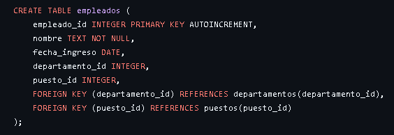
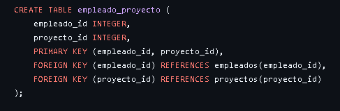
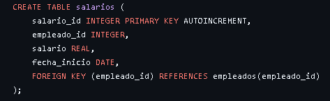

# Consultas-SQL-
Consultas realizadas en SQLite, creación de tablas Entidad/Relación.

## Creación de tablas Entidad/Relación
Creamos las tablas `departamentos`, `puestos`, `empleados`, `salarios`, `proyectos` y `empleado_proyecto`. Luego realizamos las relaciones que tienen las tablas entre ellas a través de las Foreign Keys.

## Tabla departamentos

## Tabla puestos

En esta tabla se aplica la relación de uno a muchos (1 a N), ya que un `departamento` puede tener muchos empleados y un `puesto` lo pueden tener distintos empleados.

## Tabla proyectos

Aqui ocurre algo similar pero diferente. Esta tabla aplica la relación de muchos a muchos (N a M), esto ocurre porque un `empleado` puede trabajar en varios proyectos y un `proyecto` puede tener varios empleados trabajando en el. 

La tabla salarios tambien tiene una relación de 1 a N, debido a que un `empleado` puede tener dintintos `salarios` a lo largo del tiempo en la empresa.

